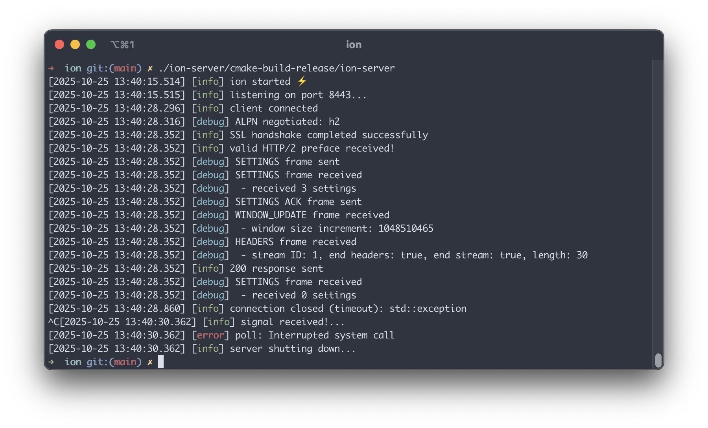

# Ion :zap:

[](https://github.com/rhargreaves/ion/actions/workflows/build.yml)

Light-weight HTTP/2 server in C++

## Goals

I'm using this as a learning exercise to learn more about HTTP/2 and modern C++.
As such, I am intentionally using low-level APIs and avoiding libraries for the core flow (but using modern C++ features
to wrap the POSIX interfaces).
It is not intended to be a production-ready server!
I'm documenting non-obvious stuff I've learnt along the way in [LEARNINGS.md](docs/LEARNINGS.md).

## Progress

* Basic HTTP/2 over TLS
* Register routes (path & method) and return status codes
* Supports request & response headers:
    * Static table entries
    * Dynamic table entries
    * Huffman encoded & plain text strings
* Supports response body, status codes & headers
* Close server using Ctrl+C (`SIGINT`) or `SIGTERM`

<p align="center">

</p>

## Example Usage

```c++
#include "ion/http2_server.h"

int main() {
    ion::Http2Server server{};
    auto& router = server.router();

    router.register_handler("/", "GET", [] {
        return ion::HttpResponse {.status_code = 200};
    });

    router.register_handler("/body", "GET", [] {
        const std::string body_text = "hello";
        const std::vector<uint8_t> body_bytes(body_text.begin(), body_text.end());

        return ion::HttpResponse{
            .status_code = 200, .body = body_bytes, .headers = {{"content-type", "text/plain"}}};
    });

    server.run_server(8443);
    return 0;
}
```

See [app/main.cpp](app/main.cpp) for a more complete example, including signal handling.

## Build

Requirements:

* CMake 4.0+
* Clang 17+
* OpenSSL 3+
* Python 3.13+

Development is typically done using JetBrains CLion.

### macOS

```sh
make build
```

### Linux

Docker:

```sh
docker build -t ion .

docker run -it \
  -e BUILD_SUFFIX=docker \
  -p 8443:8443 \
  -w /workspace \
  -v $(pwd):/workspace ion \
  make run
```

Make:

```sh
make build
```

## Demo App Usage

```sh
./build/make/app/ion-server &
curl -k --http2 -v https://localhost:8443/
```

## Test

Run all tests using `make test`

### Unit & Integration Tests

C++-based Catch2 tests:

```
make test-unit
make test-integration
```

### System Tests

Python-based tests employing `curl`, `hyperh2` & `httpx` to test the server end-to-end:

```
make test-system
```

### HTTP/2 Spec Tests

Using [h2spec](https://github.com/summerwind/h2spec):

```
make test-h2spec
```

## References

* [RFC 9113 - HTTP/2](https://datatracker.ietf.org/doc/html/rfc9113)
* [RFC 7541 - HPACK: Header Compression for HTTP/2](https://datatracker.ietf.org/doc/html/rfc7541)
